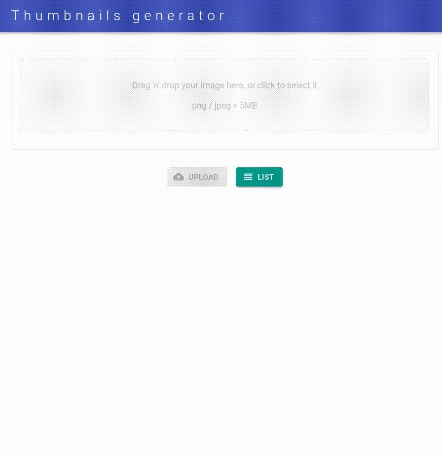
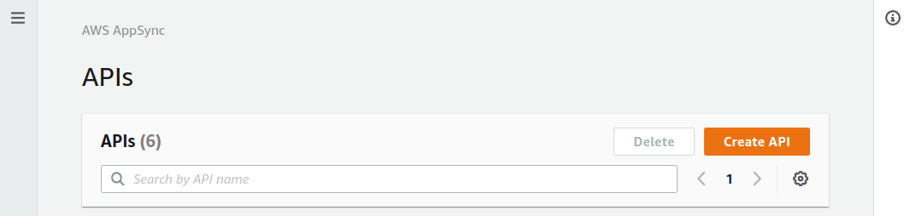
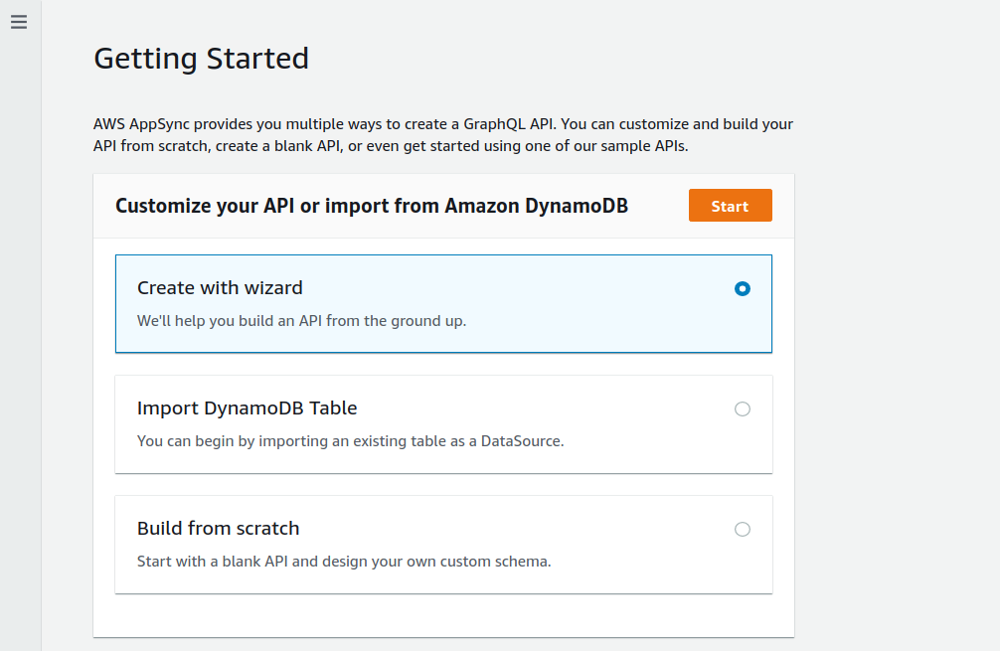
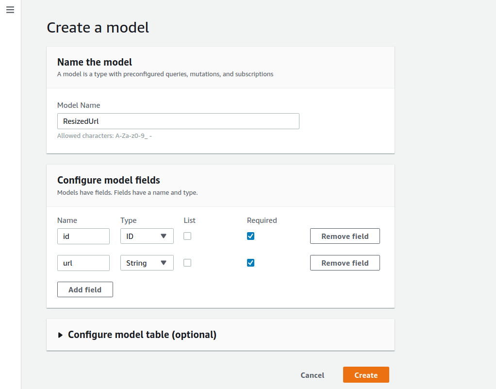
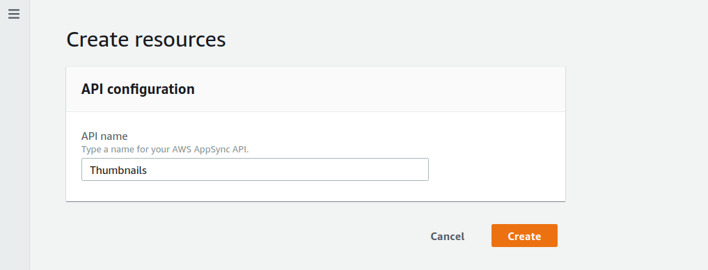
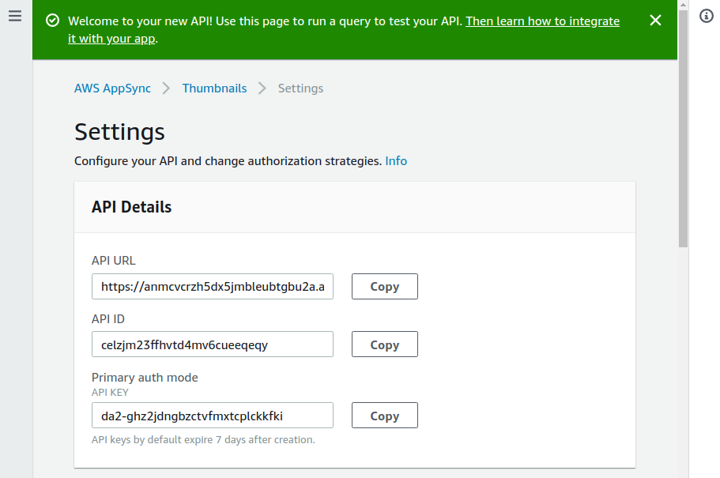

<h1 align="center">Thumbnails generator with AWS Lambda, API Gateway, AppSync, DynamoDB, S3 and SAM 📢</h1>
<p>
  
  <a href="#" target="_blank">
    
  </a>
</p>

### Description

Build a page with a drag and drop area in which you will be able to generate a 200px thumbnail version of your jpg/jpeg/png files.<br /><br />


### Frontend part

This project is composed by two repositories: this one which is the api backend and this [React frontend](https://github.com/s4nt14go/thumbnails-react) is the other. Start with this repository and then continue with frontend.

### Requirements:
* [AWS account](https://aws.amazon.com)
* [AWS CLI](https://aws.amazon.com/cli)
* [AWS Serverless Application Model (SAM) CLI](https://aws.amazon.com/serverless/sam)

### Instructions

1. In this first step we will use the AWS console to setup AppSync, which under the hoods will deploy a DynamoDB table. AppSync is the managed GraphQL service which will handle our database operations, that will contain the urls for the images resized, as well as gives us real-time updates sent to our frontend.<br /><br />
Use your browser to log into your AWS console and create a new AppSync API (check you create it into the AWS region you will be working on this project):<br /><br />
<br /><br />
<br /><br />
<br /><br />
<br /><br />
This will create the DynamoDB table as well as our GraphQL schema and resolvers. Go into your new API created and take note of the API URL endpoint and API KEY<br /><br />
<br /><br />
Now we will continue to deploy the rest of our infrastructure with Serverless Application Model (SAM)

1. Clone this repo<br /><br />
`git clone https://github.com/s4nt14go/thumbnails-aws`
1. Check your are using your AWS credentials and the region you want<br /><br />
`aws configure list`
1. We will first build the project locally and then deploy it, so `cd` into the repo root folder and run<br /><br />
`sam build`
1. Make a S3 bucket which we will use when deploying. For the following parts I will use some names as examples, you may have to choose different ones because they have to be unique (for example you can add a random suffix to make them unique)<br /><br />
`aws s3 mb s3://stack-thumbnails-artifacts`
1. Running `sam deploy` we will deploy the resources declared into `template.yml`<br /><br />
`sam deploy --stack-name myStack --s3-bucket lambda-deployment-artifacts --capabilities CAPABILITY_IAM`<br /><br />
One of the lambdas deployed is `upload` that we will use from the React app to get an url to upload the image to be resized, also we are deploying a bucket where we will upload our image to.<br /><br />
Once CloudFormation ends deploying our `template.yml`, it will output values for `imageToResize` and `uploadApi`. With the `imageToResize` part of our `template.yml` we create the bucket to upload our images, take note of the value outputted by CloudFormation for `imageToResize` which is the bucket name.<br /><br />
Create an `.env` file inside `upload` folder filling it with the bucket name<br /><br />
`S3_BUCKET=<imageToResize bucket name>`
1. Create an `.env` file inside `resize` folder filling it with the AppSync API settings<br />
    ```
    AWS_REGION=<your region>
    APPSYNC_ENDPOINT_URL=<your AppSync API endpoint>
    APPSYNC_API_KEY=<your AppSync API key>
    ```
1. Let's check the lambda function `upload`<br /><br />
`curl --request GET \
   --url "<uploadApi output by CloudFormation>=test.txt"`<br /><br />
If everything went well you should receive a link to upload the image specified in `upload/event.json`

1. Every time an image is uploaded to bucket `imageToResize`, lambda function `resize` will run and resize it, and also will launch a mutation to AppSync, so the React app (that will be subscribed to receive real-time changes) will pick up the change and show the resized image.<br /><br />
So to check that lambda `resized` works well, we can upload an image to the bucket and we should see the `resize` logs printing `Resized and mutated to AppSync successfully!!`.<br /><br />
So let's copy an image to S3, using the value outputted by CloudFormation when created bucket `imageToResize` and check it shows the expected successful message<br /><br />
`aws s3 cp resize/test.jpeg s3://<imageToResize bucket name output by CloudFormation>/test.jpeg`<br />
1. If you would like to remove the images Now that everything works well go ahead with the [React client](https://github.com/s4nt14go/thumbnails-react)!
